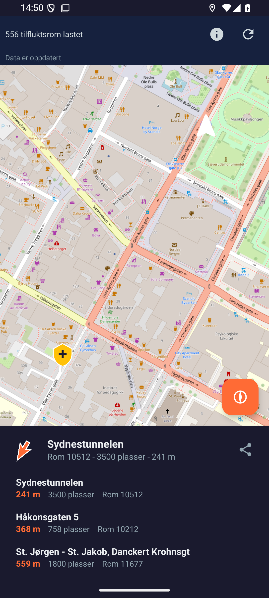
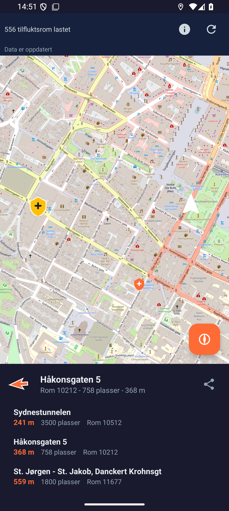
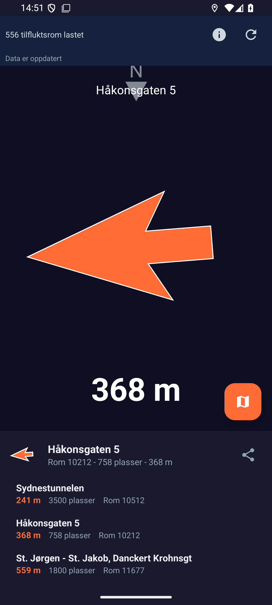
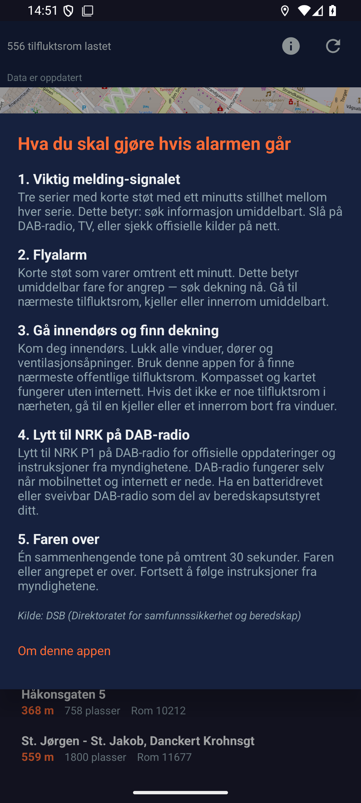
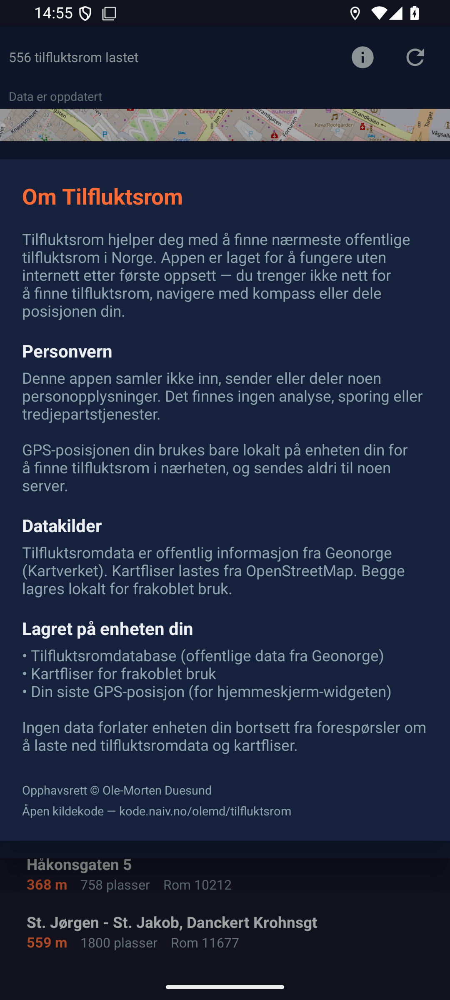

# Tilfluktsrom

Finn nærmeste offentlige tilfluktsrom i Norge. Appen er bygd for nødsituasjoner og fungerer uten internett etter første gangs bruk.

<p align="center">
  
  
  
  
  
</p>

## Slik fungerer appen

**Kartvisning** — Appen viser alle 556 offentlige tilfluktsrom i Norge på et OpenStreetMap-kart. De tre nærmeste tilfluktsrommene vises i bunnen med avstand, kapasitet og romnummer. Trykk på en kartmarkering eller et listeelement for å velge et tilfluktsrom.

**Kompassnavigasjon** — Trykk på kompassknappen for å bytte til retningspil-visning. En stor pil peker mot det valgte tilfluktsrommet, med avstand i meter eller kilometer. En diskret nordindikator vises på kanten slik at du kan verifisere kompasskalibreringen. Fungerer uten internett — bare GPS og kompassensor.

**Sivilforsvarsinfo** — Trykk på info-knappen for å se trinn-for-trinn-veiledning fra DSB om hva du skal gjøre når alarmen går: viktig melding-signal, flyalarm, finn dekning, lytt til NRK på DAB-radio, og faren over.

**Om og personvern** — Appen samler ikke inn persondata. Alt skjer lokalt på enheten. Se om-siden i appen for fullstendig personvernerklæring, datakilder og opphavsrett.

## Funksjoner

- **Finn nærmeste tilfluktsrom** — viser de tre nærmeste med avstand og kapasitet
- **Kompassnavigasjon** — retningspil som peker mot valgt tilfluktsrom, med nordindikator
- **Frakoblet kart** — kartfliser lagres automatisk for bruk uten nett
- **Velg fritt** — trykk på en markering i kartet for å navigere dit
- **Del tilfluktsrom** — send adresse, kapasitet og koordinater til andre
- **Sivilforsvarsinfo** — veiledning fra DSB om hva du skal gjøre når alarmen går
- **Hjemmeskjerm-widget** — viser nærmeste tilfluktsrom uten å åpne appen
- **Flerspråklig** — engelsk, bokmål og nynorsk
- **Tilgjengelighet** — TalkBack-støtte, fokusindikatorer og tilstrekkelig kontrast

## Plattformer

### Android-app (`app/`)

Native Kotlin-app med OSMDroid-kart og Room-database.

- **Minstekrav:** Android 8.0 (API 26)
- **Bygg:** `./gradlew assembleDebug`
- **Installer:** `adb install app/build/outputs/apk/debug/app-debug.apk`

### Nettapp / PWA (`pwa/`) — **ikke testet**

> **OBS:** PWA-versjonen er under utvikling og er foreløpig ikke manuelt testet i nettleser. Koden kompilerer og enhetstester passerer, men den er ikke verifisert i praksis.

Progressiv nettapp med Vite, TypeScript og Leaflet. Kan installeres på alle enheter via nettleseren.

- **Avhengigheter:** `bun install`
- **Hent tilfluktsromdata:** `bun run fetch-shelters`
- **Utviklingsserver:** `bun run dev`
- **Bygg for produksjon:** `bun run build`
- **Kjør tester:** `bun test`

## Datakilde

Tilfluktsromdata er offentlig informasjon fra [DSB](https://www.dsb.no/) (Direktoratet for samfunnssikkerhet og beredskap), distribuert via [Geonorge](https://www.geonorge.no/) som GeoJSON i UTM33N-projeksjon (EPSG:25833). Koordinatene konverteres til WGS84 (bredde-/lengdegrad) for visning i kartet.

Datasettet inneholder ca. 556 offentlige tilfluktsrom med adresse, romnummer og kapasitet (antall plasser).

## Arkitektur

```
tilfluktsrom/
├── app/                    # Android-app (Kotlin)
│   └── src/main/
│       ├── java/.../
│       │   ├── data/       # Room-database, nedlasting, GeoJSON-parser
│       │   ├── location/   # GPS, nærmeste tilfluktsrom
│       │   ├── ui/         # Retningspil, liste-adapter, om-dialog
│       │   ├── widget/     # Hjemmeskjerm-widget
│       │   └── util/       # UTM→WGS84-konvertering, avstandsberegning
│       └── res/            # Layout, strenger (en/nb/nn), ikoner
├── pwa/                    # Nettapp (TypeScript)
│   ├── src/
│   │   ├── data/           # IndexedDB-cache
│   │   ├── location/       # GPS, kompass
│   │   ├── ui/             # Kart, kompass, liste
│   │   ├── cache/          # Kartfliser for frakoblet bruk
│   │   └── i18n/           # Oversettelser
│   └── scripts/            # Bygg-tidsskript for datakonvertering
└── CLAUDE.md               # Prosjektdokumentasjon for AI-assistert utvikling
```

## Frakoblet bruk

Appen er designet etter «offline-first»-prinsippet:

1. **Tilfluktsromdata** lagres lokalt etter første nedlasting (Room / IndexedDB)
2. **Kartfliser** caches automatisk for området rundt brukeren
3. **GPS og kompass** fungerer uten internett
4. Data oppdateres automatisk i bakgrunnen når det er eldre enn 7 dager

## Sikkerhet

- All nettverkstrafikk går over HTTPS (klartekst er deaktivert)
- Content Security Policy (CSP) i PWA-versjonen
- Tilfluktsromdata valideres ved parsing (koordinater innenfor Norge, gyldige felt)
- Databaseoppdateringer er atomiske (transaksjon) for å unngå datatap
- Lagret GPS-posisjon utløper automatisk etter 24 timer
- Egendefinert User-Agent forhindrer enhetsfingeravtrykk

## Personvern

Appen samler ikke inn, sender eller deler noen personopplysninger. Det finnes ingen analyse, sporing eller tredjepartstjenester. GPS-posisjonen brukes bare lokalt på enheten for å finne nærmeste tilfluktsrom, og sendes aldri til noen server. Se om-siden i appen for fullstendig personvernerklæring.

## Opphavsrett

Copyright (c) Ole-Morten Duesund <olemd@glemt.net>

## Lisens

Kildekoden er lisensiert under [Mozilla Public License 2.0](LICENSE).

Appen bruker åpne data og tjenester fra flere kilder. Se [SOURCES.md](SOURCES.md) for en fullstendig oversikt over datakilder, URL-er og lisenser.

## Se også

- [STANDING_ON_SHOULDERS.md](STANDING_ON_SHOULDERS.md) — estimat over de ~119 000 menneskene som har gjort denne appen mulig
