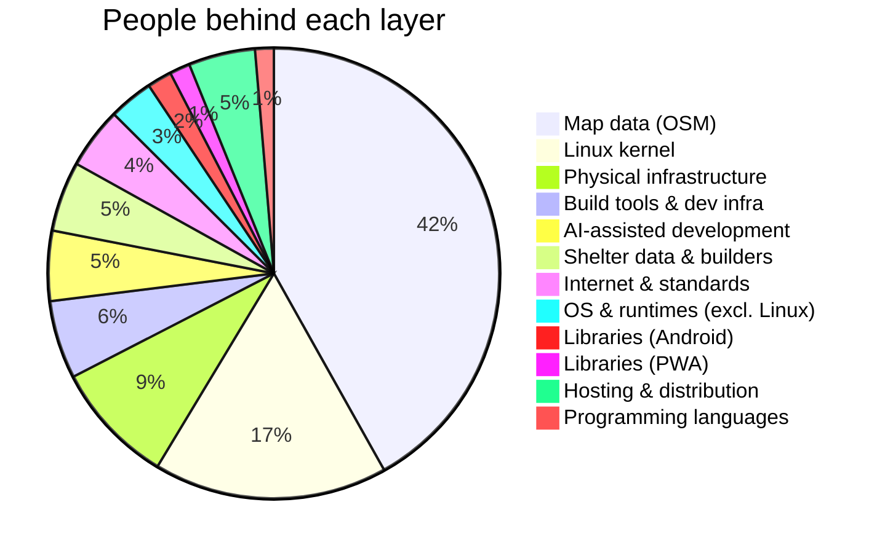

# Standing on Shoulders

## How many people made this app possible?

Tilfluktsrom is a small Android app — about 900 source files — that helps
Norwegians find their nearest public shelter in an emergency. One person built
it in under a day. But that was only possible because of the accumulated work of
roughly **119,000 people**, spanning decades, countries, and disciplines.

This document traces the human effort behind every layer of the stack, with
sources for each estimate.

---

## Layer 0: Physical Infrastructure — GPS & Sensors (~10,500 people)

| Component | Role | Est. people | Source |
|---|---|---|---|
| GPS constellation | 31 satellites, maintained by US Space Force | ~5,000 | Industry estimate; [GPS.gov](https://www.gps.gov/) |
| Magnetometer/compass sensors | Enable the direction arrow to point at shelters | ~500 | Industry estimate |
| ARM architecture | The CPU instruction set running every Android device | ~5,000 | [Arm had 8,330 employees in 2025](https://www.macrotrends.net/stocks/charts/ARM/arm-holdings/number-of-employees); ~5,000 estimated over the architecture's 40-year history |

Before a single line of code runs, hardware designed by tens of thousands of
engineers must be in orbit, in your pocket, and on the circuit board.

## Layer 1: Internet & Standards (~5,250 people)

| Component | Role | Est. people | Source |
|---|---|---|---|
| TCP/IP, DNS, HTTP, TLS | The protocols that carry shelter data from server to phone | ~5,000 | Cumulative IETF/W3C contributors over decades |
| GeoJSON specification | The format the shelter data is published in (IETF RFC 7946) | ~50 | [RFC 7946 authors + WG](https://datatracker.ietf.org/doc/html/rfc7946) |
| EPSG / coordinate reference systems | The math behind UTM33N → WGS84 coordinate conversion | ~200 | [IOGP Geomatics Committee](https://epsg.org/) |

## Layer 2: Operating Systems & Runtimes (~23,800 people)

| Component | Role | Est. people | Source |
|---|---|---|---|
| Linux kernel | Foundation of Android | ~20,000 | [Linux Foundation: ~20,000+ unique contributors since 2005](https://www.linuxfoundation.org/blog/blog/2017-linux-kernel-report-highlights-developers-roles-accelerating-pace-change) |
| Android (AOSP) | Mobile OS, incl. ART runtime | ~2,000 | [ResearchGate study: ~1,563 contributors](https://www.researchgate.net/figure/Top-Companies-Contributing-to-Android-Projects_tbl3_236631958); likely higher now |
| OpenJDK | The Java runtime Kotlin compiles to | ~1,800 | [GitHub: ~1,779 contributors](https://github.com/openjdk/jdk) |

## Layer 3: Programming Languages (~1,600 people)

| Language | Origin | Contributors | Source |
|---|---|---|---|
| Kotlin | JetBrains + community | ~765 | [GitHub: JetBrains/kotlin](https://github.com/JetBrains/kotlin) |
| TypeScript | Microsoft + community (for the PWA) | ~823 | [GitHub: microsoft/TypeScript](https://github.com/microsoft/TypeScript) |

## Layer 4: Build Tools & Dev Infrastructure (~6,700 people)

| Tool | Role | Contributors | Source |
|---|---|---|---|
| Gradle | Build automation | ~869 | [GitHub: gradle/gradle](https://github.com/gradle/gradle) |
| Android Gradle Plugin | Android-specific build pipeline | ~200 | Google internal; estimate |
| KSP (Kotlin Symbol Processing) | Code generation for Room database | ~100 | Estimate based on [GitHub: google/ksp](https://github.com/google/ksp) |
| R8 / ProGuard | Release minification and optimization | ~100 | Estimate |
| Vite | PWA bundler | ~1,100 | [GitHub: vitejs/vite](https://github.com/vitejs/vite) |
| Bun | Package manager and JS runtime | ~733 | [GitHub: oven-sh/bun](https://github.com/oven-sh/bun) |
| Git | Version control | ~1,820 | [GitHub: git/git](https://github.com/git/git) |
| Android Studio / IntelliJ | IDE | ~1,500 | Estimate; JetBrains + Google |
| Maven Central, Google Maven, npm | Package registry infrastructure | ~300 | Estimate |

## Layer 5: Libraries — Android App (~2,100 people)

| Library | What it does | Contributors | Source |
|---|---|---|---|
| AndroidX (Core, AppCompat, Room, WorkManager, etc.) | UI, architecture, database, scheduling | ~1,000 | [GitHub: androidx/androidx](https://github.com/androidx/androidx) monorepo |
| Material Design Components | Visual design language and components | ~199 | [GitHub: material-components-android](https://github.com/material-components/material-components-android) |
| Kotlinx Coroutines | Async data loading without blocking the UI | ~308 | [GitHub: Kotlin/kotlinx.coroutines](https://github.com/Kotlin/kotlinx.coroutines) |
| OkHttp | Downloads the GeoJSON ZIP from Geonorge | ~287 | [GitHub: square/okhttp](https://github.com/square/okhttp) |
| OSMDroid | Offline OpenStreetMap rendering | ~105 | [GitHub: osmdroid/osmdroid](https://github.com/osmdroid/osmdroid) |
| Play Services Location | FusedLocationProvider for precise GPS | ~200 | Google internal; estimate |
| SQLite | The embedded database engine | **~4** | [sqlite.org/crew.html](https://sqlite.org/crew.html) — the most deployed database in the world, maintained by 3–4 people |

## Layer 6: Libraries — PWA (~1,750 people)

| Library | Role | Contributors | Source |
|---|---|---|---|
| Leaflet | Interactive web maps (created in Ukraine) | ~865 | [GitHub: Leaflet/Leaflet](https://github.com/Leaflet/Leaflet) |
| leaflet.offline | Offline tile caching | ~20 | Estimate based on GitHub |
| idb | IndexedDB wrapper for offline storage | ~30 | Estimate based on GitHub |
| vite-plugin-pwa | Service worker and Workbox integration | ~100 | Estimate based on GitHub |
| Vitest | Test framework | ~718 | [GitHub: vitest-dev/vitest](https://github.com/vitest-dev/vitest) |

## Layer 7: Data — The Content That Makes It Useful (~56,000 people)

| Source | Role | Est. people | Source link |
|---|---|---|---|
| OpenStreetMap | Global map data | ~50,000 | [~2.25M have ever edited; ~50,000 active monthly](https://wiki.openstreetmap.org/wiki/Stats) |
| Kartverket / Geonorge | Norwegian Mapping Authority; national geodata infrastructure | ~800 | [kartverket.no](https://www.kartverket.no/) |
| DSB | Created and maintains the public shelter registry | ~200 | [dsb.no](https://www.dsb.no/) |
| The shelter builders | Construction, engineering, civil defense planning since the Cold War | ~5,000 | Estimate based on ~556 shelters built 1950s–80s |

The app's data exists because of Cold War civil defense planning. The shelters
were built in the 1950s–80s, digitized by DSB, published via Geonorge's open
data mandate — a chain of decisions spanning 70 years that now fits in a 320 KB
GeoJSON file.

## Layer 8: AI-Assisted Development (~6,000 people)

| Component | Role | Est. people | Source |
|---|---|---|---|
| Anthropic / Claude | Researchers, engineers, safety team | ~1,000 | [anthropic.com](https://www.anthropic.com/) |
| ML research lineage | Transformers, attention, RLHF, scaling laws — across academia & industry | ~5,000 | Estimate across all contributing institutions |
| Training data | The collective written output of humanity | incalculable | |

## Layer 9: Hosting & Distribution (~5,700 people)

| Component | Role | Contributors | Source |
|---|---|---|---|
| Forgejo / Gitea | Hosts this project at kode.naiv.no; Forgejo forked from Gitea in 2022 | ~800 | [Forgejo: ~230 contributors](https://codeberg.org/forgejo/forgejo); [Gitea: go-gitea/gitea](https://github.com/go-gitea/gitea) |
| GitHub | Mirror repo + hosts nearly all upstream dependencies | ~3,000 | [~5,000 employees, ~50% engineers](https://kinsta.com/blog/github-statistics/) |
| F-Droid | Open-source app store infrastructure and review | ~150 | [GitLab: fdroid](https://gitlab.com/fdroid); estimate |
| Fastlane | Metadata and screenshot tooling | ~1,524 | [GitHub: fastlane/fastlane](https://github.com/fastlane/fastlane) |

---

## Summary

| Layer | People |
|---|---|
| Physical infrastructure (GPS, ARM, sensors) | ~10,500 |
| Internet & standards | ~5,250 |
| Operating systems & runtimes | ~23,800 |
| Programming languages | ~1,600 |
| Build tools & dev infrastructure | ~6,700 |
| Direct libraries (Android) | ~2,100 |
| Direct libraries (PWA) | ~1,750 |
| Data (maps, shelters, geodesy) | ~56,000 |
| AI-assisted development | ~6,000 |
| Hosting & distribution | ~5,700 |
| **Conservative total** | **~119,000** |

This is conservative. It excludes:

- The millions of OSM mappers globally whose edits feed the tile rendering pipeline
- Hardware manufacturing (semiconductor fabs, device assembly — millions of workers)
- The educators who taught all these people their craft
- The civil defense planners who decided Norway needed public shelters
- The mathematicians behind Haversine, UTM projections, and geodesy going back centuries

Including OpenStreetMap's full contributor base and hardware, the number crosses
**2 million** easily.

---

## Notable details

- **SQLite** — the most widely deployed database engine in the world (in every
  phone, browser, and operating system) — is maintained by
  [3–4 people](https://sqlite.org/crew.html). It powers every shelter lookup
  in this app.

- **Leaflet** — the JavaScript mapping library used by the PWA — was created by
  [Volodymyr Agafonkin](https://agafonkin.com/) in Kyiv, Ukraine. An emergency
  shelter app built with a mapping library from a country at war.

- **OpenStreetMap** has ~10 million registered accounts, but only ~50,000 are
  active in any given month. The map tiles this app displays are the work of a
  dedicated minority.

---

## Perspective

For every line of application code, roughly 119,000 people made the tools, data,
and infrastructure that line depends on. No single company, country, or
organization could have built this stack alone. Linux (Finland → global), Kotlin
(Czech Republic/Russia → JetBrains), OSM (UK → global), GPS (US military →
civilian), Leaflet (Ukraine), SQLite (US, public domain) — this emergency app is
a product of genuine global cooperation.

The fact that one person can build a working, offline-capable emergency app in
under a day is arguably one of the most remarkable expressions of accumulated
human cooperation — and almost none of it was coordinated by any central
authority.
